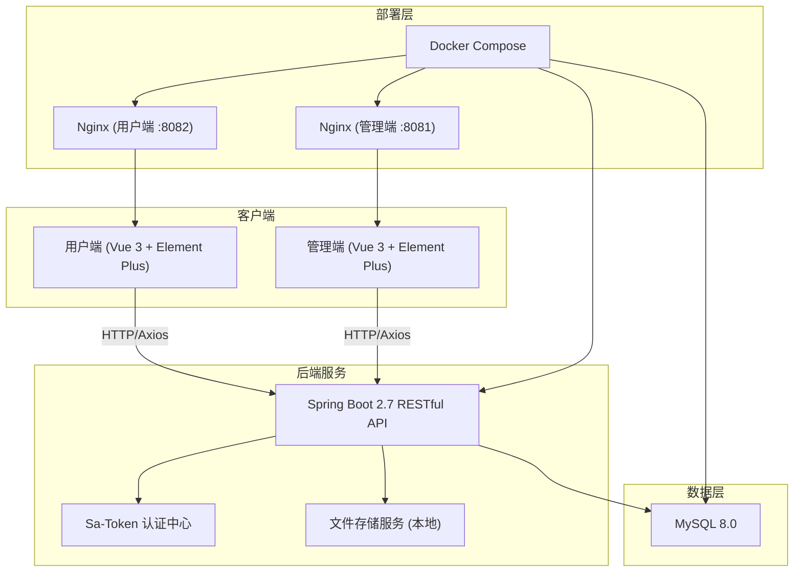
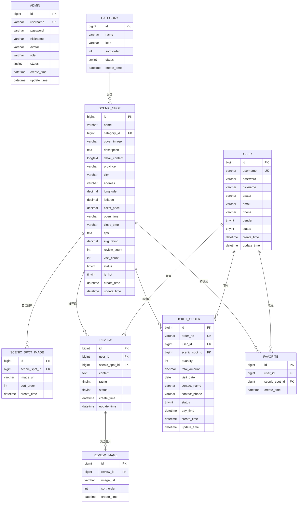
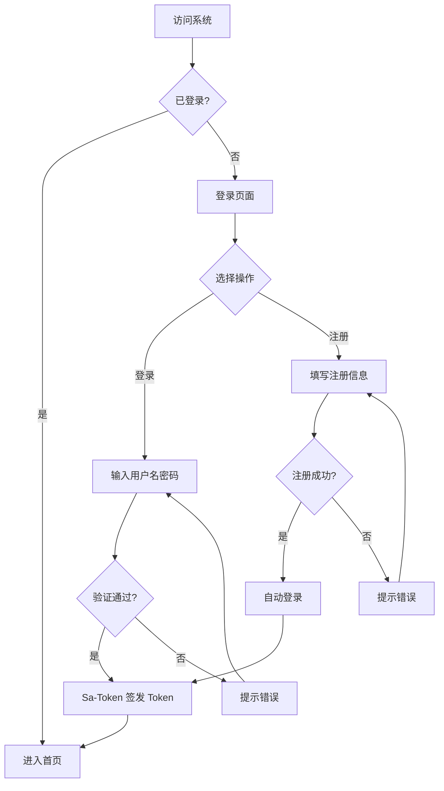
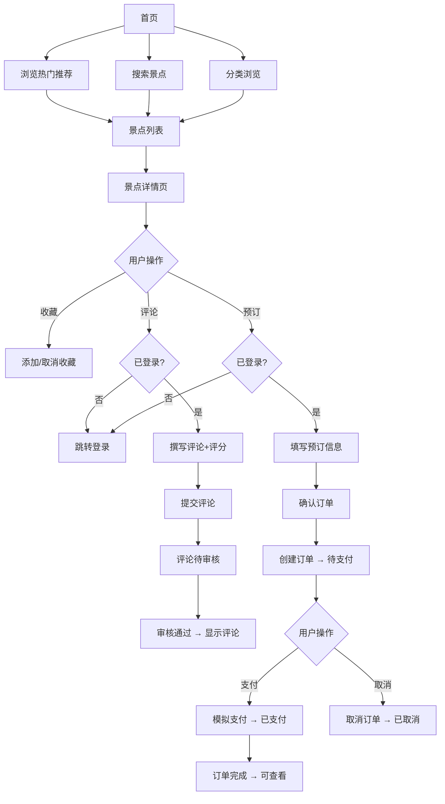
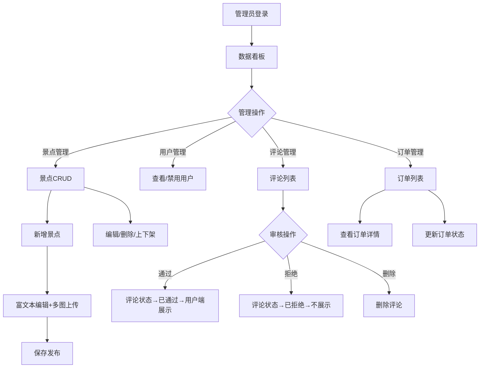

# 项目设计文档 - 旅游景点管理系统 (TravelVista)

## 1. 系统架构

### 架构说明

- **前后端完全分离**：前端通过 RESTful API 与后端通信
- **双端架构**：用户端（游客浏览、预订）+ 管理端（运营管理）
- **统一认证**：Sa-Token 提供 JWT 模式的 Token 认证，区分用户/管理员角色
- **容器化部署**：Docker Compose 一键启动所有服务

## 2. 数据模型

## 3. 接口清单

### 用户端接口

**认证模块**
- `POST /api/user/register` - 用户注册
- `POST /api/user/login` - 用户登录
- `POST /api/user/logout` - 用户登出
- `GET /api/user/info` - 获取当前用户信息
- `PUT /api/user/info` - 更新用户信息
- `PUT /api/user/password` - 修改密码
- `POST /api/user/avatar` - 上传头像

**景点模块**
- `GET /api/scenic/list` - 景点列表（分页、筛选、排序）
- `GET /api/scenic/{id}` - 景点详情
- `GET /api/scenic/hot` - 热门景点推荐
- `GET /api/scenic/search` - 景点搜索
- `GET /api/scenic/categories` - 获取分类列表

**评论模块**
- `GET /api/review/list` - 获取景点评论列表
- `POST /api/review/add` - 发表评论
- `DELETE /api/review/{id}` - 删除我的评论
- `GET /api/review/my` - 我的评论列表

**订单模块**
- `POST /api/order/create` - 创建订单
- `POST /api/order/{id}/pay` - 模拟支付
- `POST /api/order/{id}/cancel` - 取消订单
- `GET /api/order/my` - 我的订单列表
- `GET /api/order/{id}` - 订单详情

**收藏模块**
- `POST /api/favorite/toggle` - 收藏/取消收藏
- `GET /api/favorite/my` - 我的收藏列表
- `GET /api/favorite/check/{scenicId}` - 检查是否已收藏

### 管理端接口

**认证模块**
- `POST /api/admin/login` - 管理员登录
- `POST /api/admin/logout` - 管理员登出
- `GET /api/admin/info` - 获取管理员信息

**景点管理**
- `GET /api/admin/scenic/list` - 景点列表（分页）
- `GET /api/admin/scenic/{id}` - 景点详情
- `POST /api/admin/scenic/add` - 新增景点
- `PUT /api/admin/scenic/update` - 编辑景点
- `DELETE /api/admin/scenic/{id}` - 删除景点
- `PUT /api/admin/scenic/{id}/status` - 上架/下架

**分类管理**
- `GET /api/admin/category/list` - 分类列表
- `POST /api/admin/category/add` - 新增分类
- `PUT /api/admin/category/update` - 编辑分类
- `DELETE /api/admin/category/{id}` - 删除分类

**用户管理**
- `GET /api/admin/user/list` - 用户列表（分页）
- `PUT /api/admin/user/{id}/status` - 启用/禁用用户

**评论管理**
- `GET /api/admin/review/list` - 评论列表（分页）
- `PUT /api/admin/review/{id}/audit` - 审核评论（通过/拒绝）
- `DELETE /api/admin/review/{id}` - 删除评论

**订单管理**
- `GET /api/admin/order/list` - 订单列表（分页）
- `GET /api/admin/order/{id}` - 订单详情
- `PUT /api/admin/order/{id}/status` - 更新订单状态

**数据统计**
- `GET /api/admin/stats/overview` - 总览数据（用户数、景点数、订单数、收入）
- `GET /api/admin/stats/visit-trend` - 近7天访问量趋势
- `GET /api/admin/stats/order-trend` - 近7天订单趋势
- `GET /api/admin/stats/top-scenic` - 热门景点TOP10
- `GET /api/admin/stats/category-distribution` - 景点分类分布

**文件上传**
- `POST /api/admin/file/upload` - 文件上传（图片）

## 4. 页面清单

### 用户端页面

| 页面 | 路由 | 功能描述 |
|------|------|---------|
| 首页 | `/` | 轮播图、热门景点推荐、分类导航、搜索入口 |
| 景点列表 | `/scenic` | 景点卡片列表、分类筛选、排序、分页 |
| 景点详情 | `/scenic/:id` | 图片轮播、基本信息、地图定位、评论列表、预订入口 |
| 搜索结果 | `/search` | 搜索结果展示、高级筛选 |
| 登录 | `/login` | 用户登录表单 |
| 注册 | `/register` | 用户注册表单 |
| 个人中心 | `/profile` | 个人信息展示与编辑 |
| 我的收藏 | `/favorites` | 收藏的景点列表 |
| 我的订单 | `/orders` | 订单列表、状态筛选 |
| 订单详情 | `/order/:id` | 订单详细信息、操作按钮 |
| 我的评论 | `/reviews` | 已发表评论列表 |
| 预订页面 | `/booking/:id` | 填写预订信息、确认下单 |

### 管理端页面

| 页面 | 路由 | 功能描述 |
|------|------|---------|
| 登录 | `/login` | 管理员登录 |
| 数据看板 | `/dashboard` | 核心指标卡片、趋势图表、热门景点排行 |
| 景点管理 | `/scenic` | 景点列表表格、新增/编辑弹窗、上下架 |
| 景点编辑 | `/scenic/edit/:id` | 富文本编辑、多图上传、地图选点 |
| 分类管理 | `/category` | 分类列表、新增/编辑 |
| 用户管理 | `/user` | 用户列表、状态切换 |
| 评论管理 | `/review` | 评论列表、审核操作 |
| 订单管理 | `/order` | 订单列表、状态管理 |

## 5. 前端设计规范（遵循 frontend-master 标准）

### 5.1 设计方向

- **美学风格**：自然有机（Natural Organic）+ 编辑排版（Editorial）
- **设计关键词**：自然、探索、沉浸、温暖、品质感
- **情绪参考**：如同翻开一本精美的旅行杂志，既有大气的视觉冲击力，又有温暖的人文关怀。色调取自自然风光——山林的翠绿、天空的蔚蓝、夕阳的暖橙，传递旅行的愉悦与向往。

### 5.2 色彩体系

**主色 (Primary)**
- `#1A6B4F` — 深林绿，用于主要按钮、重要标识、导航高亮
- 使用场景：CTA 按钮、链接、Tab 激活态

**辅色 (Secondary)**
- `#2D7D9A` — 海洋蓝，用于辅助信息、次要操作
- 使用场景：标签、进度条、辅助按钮

**强调色 (Accent)**
- `#E8853D` — 暖橙色，用于价格标识、促销、重要提醒
- 使用场景：价格、特价标签、收藏心形、评分星星

**中性色阶梯**
| 色阶 | 色值 | 用途 |
|------|------|------|
| 50 | `#FAFAF8` | 页面背景 |
| 100 | `#F5F3EF` | 卡片背景 |
| 200 | `#E8E5DE` | 分割线 |
| 300 | `#D4D0C8` | 边框 |
| 400 | `#A8A299` | 占位文字 |
| 500 | `#7D7870` | 辅助文字 |
| 600 | `#5C5850` | 次要文字 |
| 700 | `#3D3A34` | 正文文字 |
| 800 | `#2A2722` | 标题文字 |
| 900 | `#1A1815` | 重要标题 |
| 950 | `#0D0C0A` | 纯黑 |

**语义色**
- Success: `#2E8B57` — 海洋绿
- Warning: `#D4A843` — 琥珀色
- Error: `#C75450` — 玫瑰红
- Info: `#5B8DB8` — 天空蓝

**60-30-10 分配**
- 60% 底色：`#FAFAF8` (米白) + `#F5F3EF` (暖灰)
- 30% 辅色：`#1A6B4F` (深林绿) + `#2D7D9A` (海洋蓝)
- 10% 强调色：`#E8853D` (暖橙) + 语义色

### 5.3 字体体系

**标题字体**
- 中文：`"Noto Serif SC"` (思源宋体) — Google Fonts
- 英文：`"Playfair Display"` — Google Fonts
- 使用：页面标题、景点名称、重要标题

**正文字体**
- 中文/英文：`"Noto Sans SC"` (思源黑体) — Google Fonts
- 备选：`"Source Han Sans SC"`
- 使用：正文、描述、按钮文字、表单

**字号阶梯**
| 标识 | 大小 | 用途 |
|------|------|------|
| xs | 12px | 辅助说明、标签 |
| sm | 14px | 次要信息、表单标签 |
| base | 16px | 正文 |
| lg | 18px | 小标题 |
| xl | 20px | 区块标题 |
| 2xl | 24px | 页面副标题 |
| 3xl | 30px | 页面主标题 |
| 4xl | 36px | Hero 标题 |

**行高与字重**
- 正文行高：1.6
- 标题行高：1.2 ~ 1.3
- 字重：Regular(400) / Medium(500) / Semibold(600) / Bold(700)

### 5.4 间距与布局

**基准单位**：4px

**间距阶梯**：4 / 8 / 12 / 16 / 24 / 32 / 48 / 64

**栅格系统**
- 最大宽度：1280px
- 列数：12 列
- Gutter：24px
- 外边距：≥16px

**响应式断点**
| 断点 | 宽度 | 布局 |
|------|------|------|
| sm | 640px | 单列 |
| md | 768px | 双列 |
| lg | 1024px | 三列 |
| xl | 1280px | 四列 |
| 2xl | 1536px | 四列（加宽间距） |

### 5.5 组件规范

**圆角**
- sm: 4px（按钮、输入框）
- md: 8px（卡片、弹窗）
- lg: 12px（大卡片、容器）
- xl: 16px（特殊容器）
- full: 9999px（圆形头像、标签）

**阴影层级**
- sm: `0 1px 2px rgba(0,0,0,0.05)` — 微浮起
- md: `0 4px 12px rgba(0,0,0,0.08)` — 卡片
- lg: `0 8px 24px rgba(0,0,0,0.12)` — 悬浮态
- xl: `0 16px 48px rgba(0,0,0,0.16)` — 弹窗/Drawer

**边框**
- 颜色：`#E8E5DE`
- 宽度：1px
- 使用场景：卡片边框、输入框、分割线

**卡片样式**
- 背景：`#FFFFFF`
- 边框：`1px solid #E8E5DE`
- 阴影：sm (默认) → md (hover)
- 圆角：md (8px)

### 5.6 动效规范

**过渡时长**
- 快速：150ms — 颜色变化、透明度
- 中速：250ms — 位移、缩放
- 慢速：400ms — 页面过渡、大区域展开

**缓动函数**
- 默认：`cubic-bezier(0.4, 0, 0.2, 1)`
- 弹入：`cubic-bezier(0.34, 1.56, 0.64, 1)`
- 缓出：`cubic-bezier(0, 0, 0.2, 1)`

**三层动效**

| 层级 | 动效 | 实现方案 |
|------|------|---------|
| 页面级 | 路由切换淡入淡出 | Vue Transition + CSS |
| 页面级 | 首屏交错入场 | Intersection Observer + CSS |
| 区块级 | 卡片入场动画 | translate + opacity + stagger 80ms |
| 区块级 | 列表交错入场 | transition-delay 递增 |
| 区块级 | 数字滚动 | CountUp.js 或自定义 |
| 元素级 | 按钮 Hover | scale(1.02) + shadow 加深 |
| 元素级 | 输入框 Focus | 边框色渐变 + 微扩张 |
| 元素级 | 收藏心形 | scale 弹跳 + 颜色过渡 |
| 元素级 | 图片加载 | blur → clear 渐变 |

### 5.7 平台适配说明

**目标平台**：Web (Desktop + Tablet)

**适配策略**：
- 鼠标交互为主：丰富的 hover 效果
- 自适应宽度：max-width 1280px 居中，两侧留白
- 动效无限制：充分利用 CSS Transitions + Animations
- 字体加载：Google Fonts CDN，带 fallback

## 6. 核心业务流程图

### 用户注册登录流程

### 景点浏览与预订流程

### 管理员审核流程

